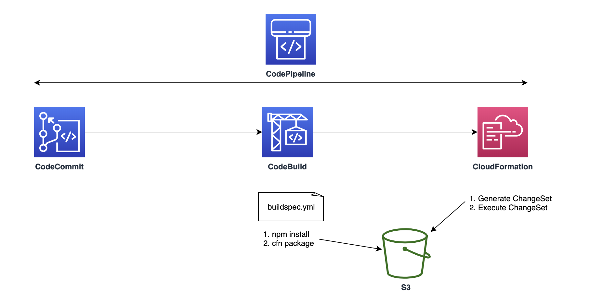
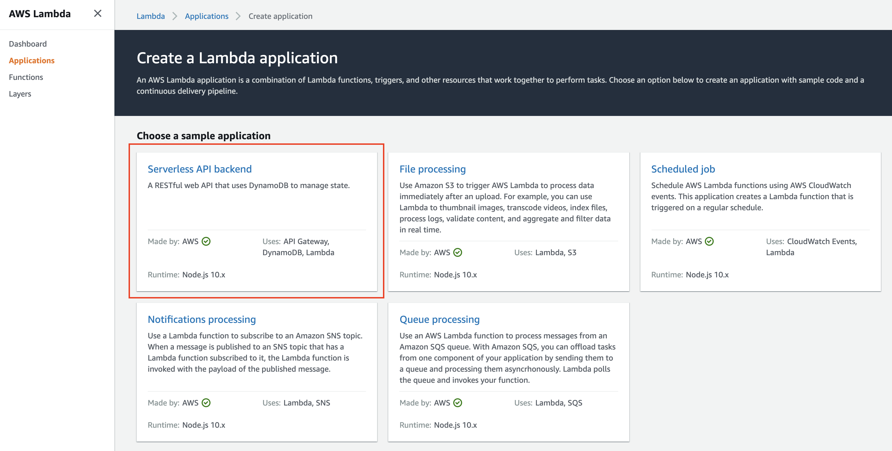
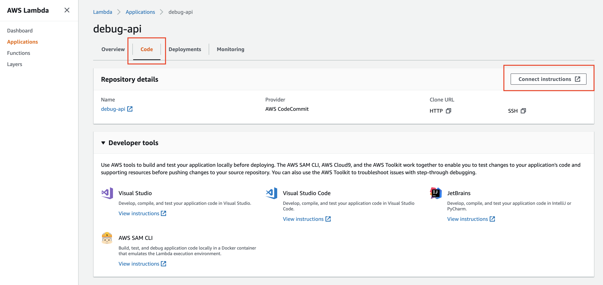

# Module 0: Lambda Applications

In this module you'll use the [AWS Lambda Console](https://console.aws.amazon.com/lambda/home?region=us-west-1#/applications) to easily create a fully serverless application with end-to-end CI/CD pipeline that will include:

* An [AWS CodeCommit](https://aws.amazon.com/codecommit/) Git repository, pre-populated with a sample RESTful API written in Node.js
* An [AWS CodeBuild](https://aws.amazon.com/codebuild/) build project
* An [AWS CodePipeline](https://aws.amazon.com/codepipeline/) continuous delivery pipeline
* An [API Gateway](https://aws.amazon.com/api-gateway/) end endpoint
* [Lambda](https://aws.amazon.com/lambda/) functions containing code logic

## Lambda Application Overview

As of 3<sup>rd</sup> Oct 2019, AWS has added a **Create application** experience to the Lambda console. This enables you to create serverless applications from ready-to-use sample applications, which follow these best practices:
- Use infrastructure as code (IaC) for defining application resources
- Provide a continuous integration and continuous deployment (CI/CD) pipeline for deployment
- Exemplify best practices in serverless application structure and methods experience to the Lambda console.

An AWS Lambda application is a combination of Lambda functions, event sources, and other resources that work together to perform tasks.

The Lambda application would create a pipeline that looks like this:
  

## 1. Create a Lambda Application

**Goal**: Use the AWS Console to create a Lambda project called `debug-api` using the **Node.js Serverless API backend** template.  Use a web browser to confirm that the API Gateway endpoint created by the Lambda Application returns `[]`, in its response.

<!--
<details>
<summary><strong>HOW TO create a Lambda Application (expand for details)</strong></summary><p>
-->
1. In the AWS Management Console choose **Services** then select **Lambda** under Compute.

2. Click on **Create Application**.

3. Select **Serverless API Backend**.
  

4. Review the services that will be launched from the creation of the Lambda application. Click on **Create**.

5. Enter `debug-api` as the **Application name**.

6. Enter a description (optional) to describe the application.

7. Select `Node.js 10.x` as the **Runtime**.

8. Select **CodeCommit** as the **Source control service**.

9. Enter `debug-api` as the **Repository name**.

10. Check **Create roles and permissions boundary**.

11. Click on **Create**.

12. Give it a few minutes for it to spin up the serverless application stack. You can head over to [CloudFormation](https://us-west-1.console.aws.amazon.com/cloudformation/home) to view detailed information about the progress.
<!--
</p></details>
<p>-->

Once completed, you can find the API Gateway endpoint under the **API Endpoint** section. Click on the link and it should show you `[]` in your browser - which is the expected result as we have not populated anything into the backend. We will test this deployment endpoint in the later steps.

## 2. Clone CodeCommit Git Repository

**Goal:** From the Lambda Application for the `debug-api` project, find the CodeCommit instructions to clone the Git repository to your local workstation.

<details>
<summary><strong>HOW TO clone the CodeCommit git repository (expand for details)</strong></summary><p>

1. In the Lambda **Application** dashboard, click on the **Code** tab.

    

2. Click on **Connect Instructions** and it will bring you to the CodeCommit page where you can follow the instructions to generate a Git credentials for your user and clone the repository to a location on your workstation.

3. In Visual Studio Code, open up the repository you have cloned earlier by clicking on **File > Add Folder to Workspace** and selecting the `debug-api`

Any new changes that are being pushed to the repository will trigger automatic execution of the project's continuous delivery pipeline. You can monitor this in the [CodePipeline](https://us-west-1.console.aws.amazon.com/codesuite/codepipeline/pipelines) console.

</p></details>
<p>

## 3. Testing your lambda application endpoints

The sample application creates a RESTful API that takes HTTP requests and invokes Lambda functions. The API has POST and GET methods on the root path to create and list items. It has a GET method that takes an ID path parameter to retrieve items. Each method maps to one of the application's three Lambda functions.

1. In Visual Studio Code, open up the Terminal window by going to **View > Terminal**.

2. Copy the API Gateway endpoint address you have clicked on earlier. To find this, go back to the Lambda **Application** dashboard, look under the **API endpoint** section and copy the URL.

3. Set the Endpoint address as a variable.
  ```bash
  $ ENDPOINT=<paste-your-endpoint-here>
  ```

3. Go back to Visual Studio Code Terminal. Use cURL to send POST requests to the application endpoint.

  ```bash
  $ curl -d '{"id":"id1", "name":"My first item"}' -H "Content-Type: application/json" -X POST $ENDPOINT
  ```
  You should get an output like this:
  ```
  {"id":"id1","name":"My first item"}
  ```

4. Let's create a second item:
  ```bash
    $ curl -d '{"id":"id2", "name":"My second item"}' -H "Content-Type: application/json" -X POST $ENDPOINT
  {"id":"id2","name":"My second item"}
  ```

4. Send a GET request to the endpoint to get a list of items.

  ```bash
  $ curl $ENDPOINT
  ```
  You should get an output like this:
  ```
  [{"id":"id1","name":"My first item"},{"id":"id2","name":"My second item"}]
  ```

## Completion

Congratulations! You have successfully created a Lambda Application, cloned the project Git repository to your workstation and tested the sample REST API.  In the next module  [1. Serverless Application Model (SAM) Module](../1_ServerlessApplicationModel), you will learn more about SAM and how to use it test your API locally.
