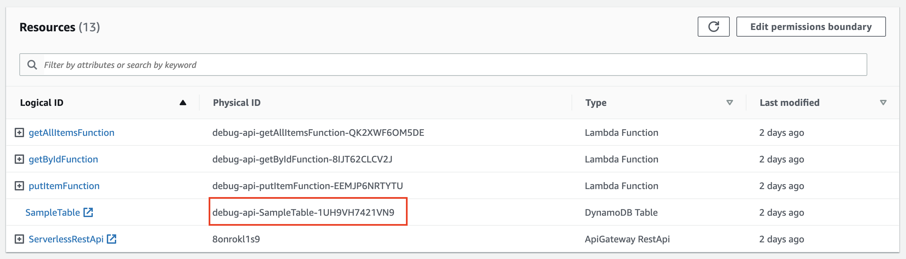
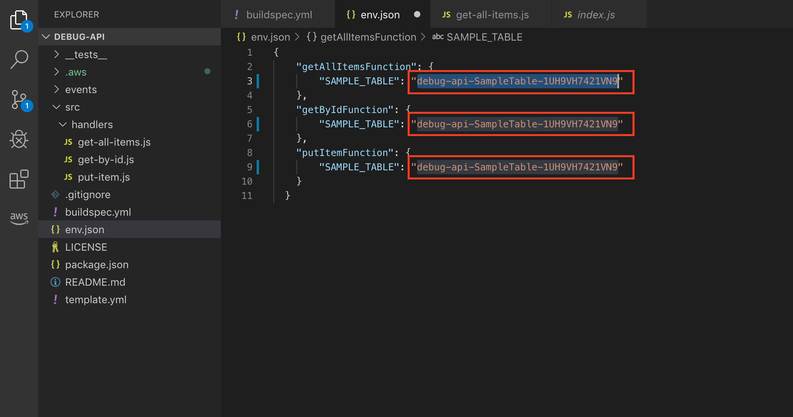
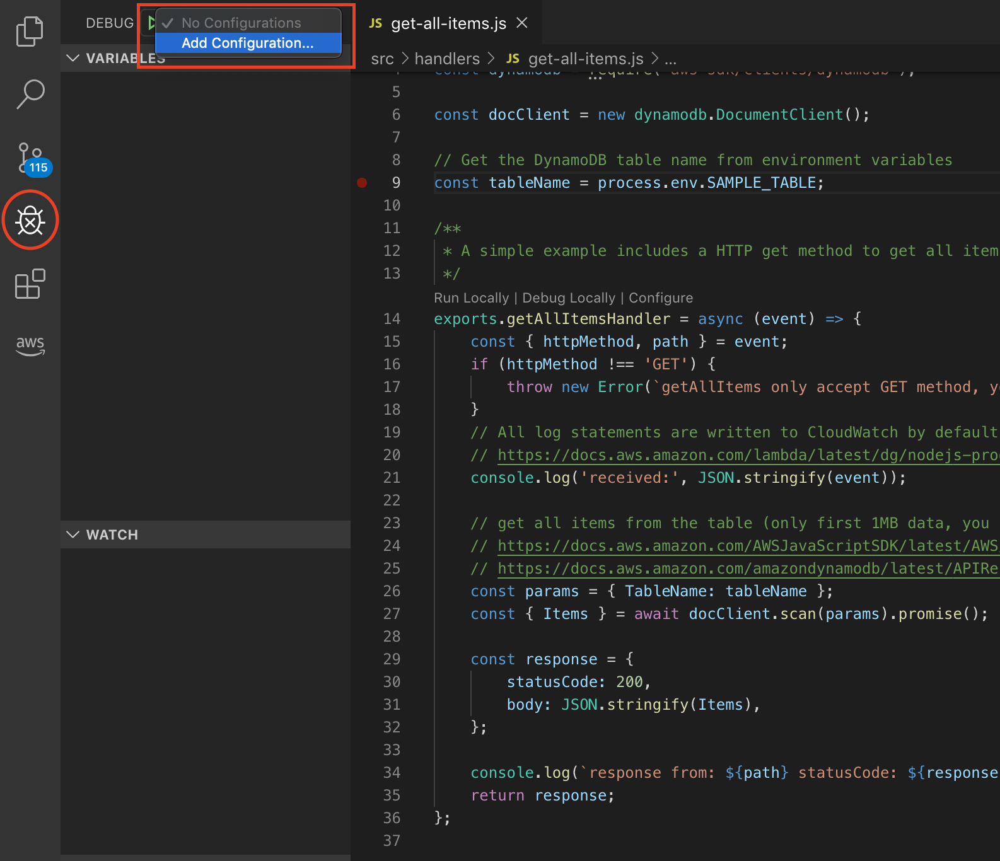
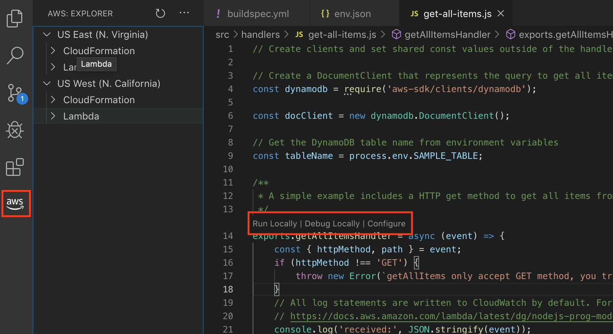
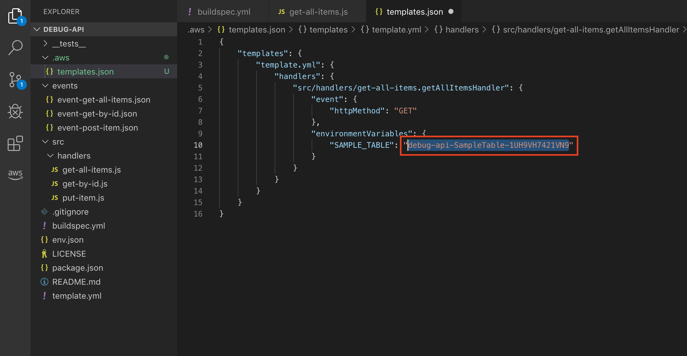
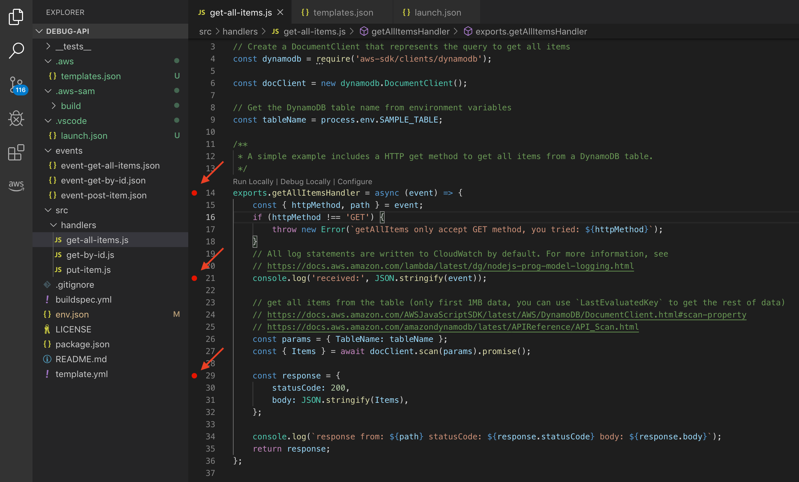

# Module 1: Serverless Application Model

In this module you'll learn about the [Serverless Application Model (SAM)](https://github.com/awslabs/serverless-application-model) and how you can use it to define a serverless RESTful API.  You will also use [SAM CLI](http://docs.aws.amazon.com/lambda/latest/dg/test-sam-local.html) to locally develop and rapidly test an API.

## Serverless Application Model (SAM) Overview

AWS SAM is a model used to define serverless applications on AWS.

Serverless applications are applications composed of functions triggered by events. A typical serverless application consists of one or more AWS Lambda functions triggered by events such as object uploads to Amazon S3, Amazon SNS notifications, and API actions. Those functions can stand alone or leverage other resources such as Amazon DynamoDB tables or S3 buckets. The most basic serverless application is simply a function.

AWS SAM is based on [AWS CloudFormation](https://aws.amazon.com/cloudformation/). A serverless application is defined in a [CloudFormation template](http://docs.aws.amazon.com/AWSCloudFormation/latest/UserGuide/gettingstarted.templatebasics.html) and deployed as a [CloudFormation stack](http://docs.aws.amazon.com/AWSCloudFormation/latest/UserGuide/updating.stacks.walkthrough.html). An AWS SAM template is a CloudFormation template.

AWS SAM defines a set of resources that describe common components of serverless applications.  In order to include objects defined by AWS SAM within a CloudFormation template, the template must include a `Transform` section in the document root with a value of `AWS::Serverless-2016-10-31`.

## 1. Build and execute functions locally

The AWS SAM command line interface (CLI) is an extension of the AWS CLI that adds functionality for building and testing Lambda applications. It uses Docker to run your functions in an Amazon Linux environment that matches Lambda. It can also emulate your application's build environment and API.

If you prefer to use an integrated development environment (IDE) to build and test your application, you can use the AWS Toolkit.
The AWS Toolkit is an open-source plugin for popular IDEs that uses the AWS SAM CLI to build and deploy serverless applications on AWS. The AWS Toolkit also adds step-through debugging for Lambda function code.

#### Invoking functions locally

1. Let's first setup our environment variables so that we can point the application to the right DynamoDB table. Head over to **Lambda Application** console under **Resources** section. Copy the table name.
  

2. Open up `env.json` and replace `<TABLE-NAME>` with the copied **Table Name** as shown below.

  

3. In Terminal window in VS Code, build your application with the `sam build` command.

  ```bash
  $ sam build -m package.json
  ```

  The AWS SAM CLI installs dependencies that are defined in `package.json`, creates a deployment package, and saves its contents in the `.aws-sam/build` folder.

  We can now test a single function by invoking it directly with a test event. An event is a JSON document that represents the input that the function receives from the event source. Sample test events are included in the `events` folder in this project.

4. Run functions locally and invoke them with the `sam local invoke` command.

  ```bash
  $ sam local invoke putItemFunction --event events/event-post-item.json --env-vars env.json
  ```
  You should see a status code 200 if successful.

5. Let's execute the function to retrieve all records to see if it was inserted.
  ```bash
  $ sam local invoke getAllItemsFunction --event events/event-get-all-items.json --env-vars env.json
  ```
  You should see the records which you have just inserted displayed correctly.

## 2. Run an API Gateway locally
You can use the `sam local start-api` command to start a local instance of API Gateway that you will use to test HTTP request/response functionality. This functionality features hot reloading to enable you to quickly develop and iterate over your functions.

1. From the `debug-api` directory, run the following command:
  ```bash
  $ sam local start-api --env-vars env.json
  ```

  This will spawn a local API Gateway to test HTTP request/response functionality. Features hot-reloading to allow you to quickly develop, and iterate over your functions.  **`sam`** will automatically find any functions within your SAM template that have `Api` event sources defined, and mount them at the defined HTTP paths.

2. Open up your browser and enter `http://127.0.0.1:3000/` in the address bar. If this is your first time running SAM CLI, there will be a delay as the Docker images are downloaded.

Congratulations!  You've successfully run Lambda function in a local development environment.

To learn more about development with SAM CLI, check out [AWS Documentation](http://docs.aws.amazon.com/lambda/latest/dg/test-sam-local.html) and SAM CLI [GitHub repository](https://github.com/awslabs/aws-sam-local).  

## 3. Debug Lambda functions locally
AWS SAM integrates with a number of AWS toolkits to test and debug your serverless applications locally. In this case, for Visual Studio Code via [AWS Toolkit for Visual Studio Code](https://aws.amazon.com/visualstudiocode/).

You can perform step-through debugging of your Lambda functions to make it easier to understand what the code is doing. It tightens the feedback loop by making it possible for you to find and troubleshoot issues that you might run into in the cloud.

1. In Visual Studio Code, click on the **Debug** tab on the left. At the top, next to the Start Debug (green arrow) button, click on the dropdown and select **Add Configuration...** to create a launch configuration.
  

2. This will automatically create a `launch.json` file in .vscode folder. Replace the existing content with the following code and replace values.
```json
{
    "version": "0.2.0",
    "configurations": [
        {
            "name": "Attach to SAM CLI",
            "type": "node",
            "request": "attach",
            "address": "localhost",
            "port": 5858,
            "localRoot": "${workspaceRoot}",
            "remoteRoot": "/var/task",
            "protocol": "inspector",
            "stopOnEntry": false
        }
    ]
}
```

3. Go back to your code by clicking on the Explorer tab. By now, you will find that [CodeLens](https://code.visualstudio.com/blogs/2017/02/12/code-lens-roundup) appears above the handler function, showing options to **Run Locally**, **Debug Locally**, or **Configure** the function.
>Note: If you do not see the CodeLens, click on the AWS Extension tab as shown below.

  

4. Click on **Configure**, which will bring up a **templates.json** file. We will need to populate the required environment variables and event parameters to execute this function.

4.  Copy the following code and replace the contents of the **templates.json** file.
  ```json
  {
      "templates": {
          "template.yml": {
              "handlers": {
                  "src/handlers/get-all-items.getAllItemsHandler": {
                      "event": {
                          "httpMethod": "GET"
                      },
                      "environmentVariables": {
                          "SAMPLE_TABLE": "<TABLE-NAME>"
                      }
                  }
              }
          }
      }
  }
  ```

5. You will notice that we need to specify the DynamoDB **table name**. Again, you may head over to **Lambda Application** console under **Resources** section to copy the table name and replace it with `<TABLE-NAME>` as shown below.

  

  

6. Now, go back to `get-all-items.js` file and add a few breakpoints.

  

7. Click on **Debug Locally** CodeLens to start debugging this function. SAM will build the application and start the debugger with the launch configuration and environment variables.

8. Once a debug session starts, the Debug toolbar will appear on the top of the editor.

9. Click on **Continue** to continue down the breakpoints. You can mouseover to view variable contents.


## Completion

You have successfully performed local development and testing of a RESTful serverless API using the Serverless Application Model.

In the next module [2. AWS X-Ray Integration](../2_XRay), you will learn how to use AWS X-Ray to analyze and debug the API.
