# Module 3: AWS X-Ray Integration

## AWS X-Ray Overview
[AWS X-Ray](https://aws.amazon.com/xray/) helps you analyze and debug distributed applications, such as those built using a microservices architecture. Using X-Ray, you can understand how your application and its underlying services are performing to identify and troubleshoot the root causes of performance issues and errors.

X-Ray provides an end-to-end view of requests as they travel through your application, and shows a map of your application's underlying components. You can use X-Ray to analyze both applications in development and in production.

Next, we'll look at how to integrate X-Ray with Lambda.

### AWS X-Ray Integration with AWS Lambda

Using AWS X-Ray to trace requests enables you to gain insights into the performance of serverless applications, allowing you to pinpoint the root cause of issues so that you can address them.

To integrate X-Ray with Lambda, a few changes are required.

#### Enable Active Tracing on Lambda Functions

1. Open up `template.yml` located in the project root. This is the SAM template that specifies the list of resources and configurations for your serverless application.

2. Make changes to include `Tracing: Active` anywhere within **Properties** as shown below for all 3 of the Serverless Function resources. Save the file.

  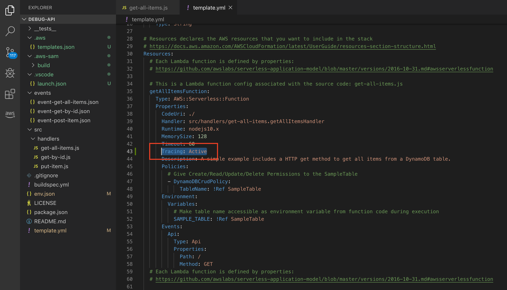

#### Integrate AWS X-Ray SDK into the project

To integrate the X-Ray SDK into the Node.js API, the [aws-xray-sdk](https://www.npmjs.com/package/aws-xray-sdk) node module has to be added as a project dependency using [npm](https://www.npmjs.com/).  

1. Open up `package.json` located in the root of the folder.

2. Add `"aws-xray-sdk": "^2.5.0"` below `aws-sdk` while remembering to add the comma as shown below. Save the file.

  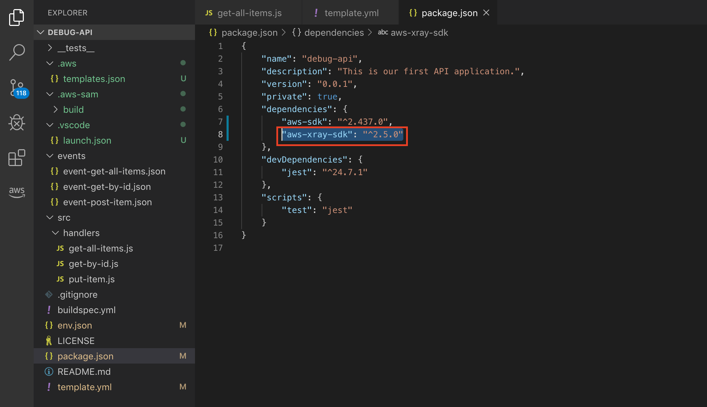

#### Integrate AWS X-Ray SDK into the function

With the addition of the [aws-xray-sdk](https://www.npmjs.com/package/aws-xray-sdk) library to the project, the library needs to be integrated into the application code.  Below are the Lambda function initialization code snippets before and after the X-Ray integration.

1. Open up `get-all-items.js`. We will replace 2 lines from the top of the code with 4 lines as per below. Save the file.

  Before:
  ```js
  // Create a DocumentClient that represents the query to get all items
  const dynamodb = require('aws-sdk/clients/dynamodb');

  const docClient = new dynamodb.DocumentClient();
  ```

  After:
  ```js
  // Create a DocumentClient that represents the query to get all items
  const AWSXRay = require('aws-xray-sdk');
  const AWS = AWSXRay.captureAWS(require('aws-sdk'));
  const docClient = new AWS.DynamoDB.DocumentClient();
  AWSXRay.setContextMissingStrategy("LOG_ERROR");
  ```

2. Once done, we will push the changes into our CodeCommit repository. Before that, open up `.gitignore` and add `.*` as shown below so that we exclude the temporary files built by SAM earlier. Save the file.

  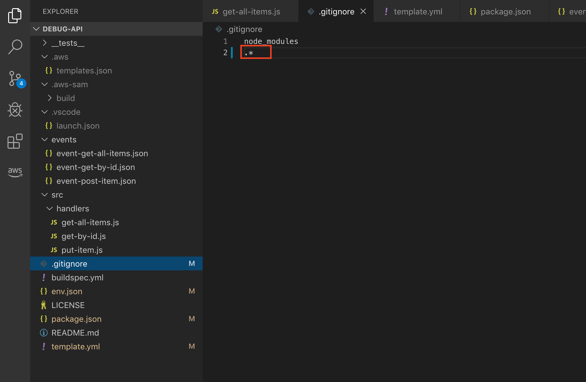

3. Click on **Source Control** tab on the left to bring up the git integration panel.

4. Click on the "+" icon to stage all changes.

  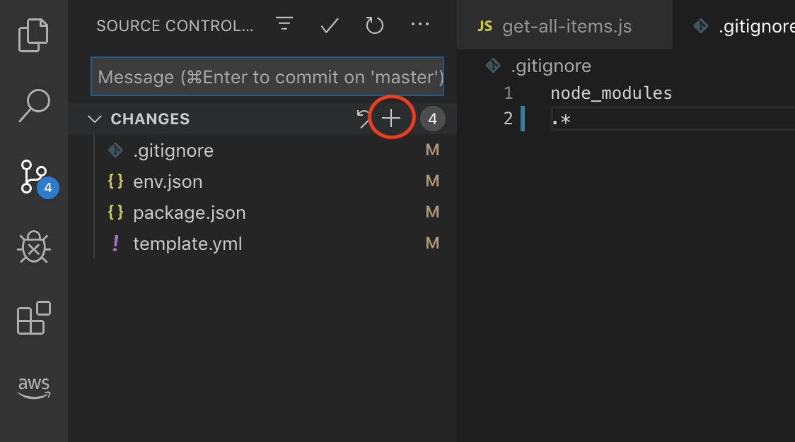

5. Type in a commit message and click on the tick to commit staged changes.

  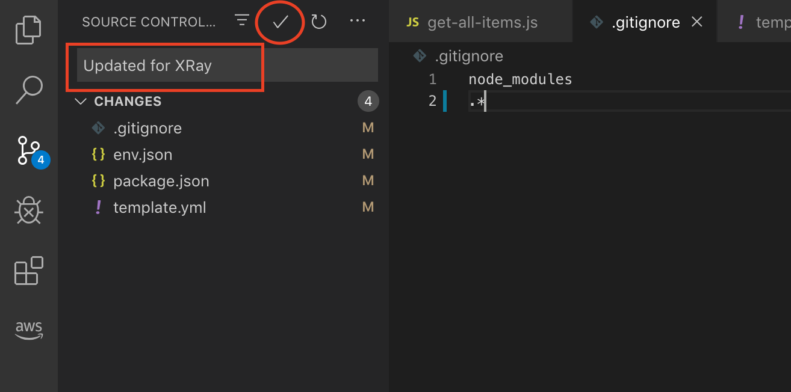

6. Click on the "..." and select **Push** to push the changes into your repository.

  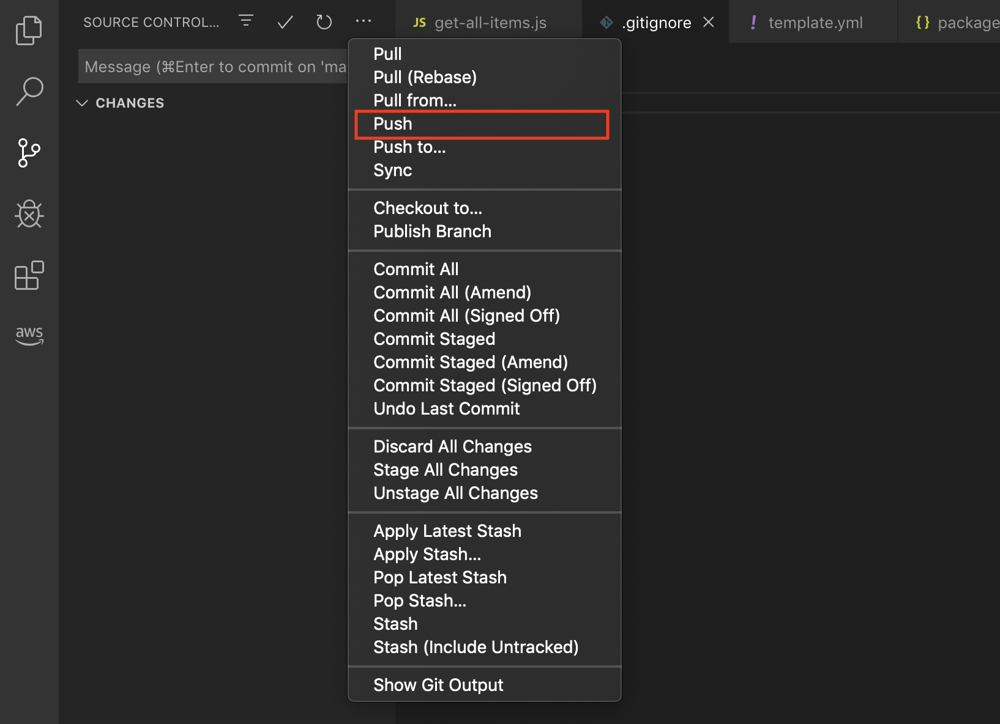

7. This will trigger CodePipeline to pull the latest code, build and deploy it to our endpoint. You can view the progress in the [CodePipeline](https://us-west-1.console.aws.amazon.com/codesuite/codepipeline/pipelines/) console.

As you can see, the basic X-Ray integration into Lambda requires only a few changes.  One new line of code to include the `aws-xray-sdk`, and a second modification to wrap the `aws-sdk` library with X-Ray. This causes all the AWS API calls to be wrapped by X-Ray for instrumentation without having to change the code further.

### 1. Using X-Ray Service Map

1. Go back to the [Lambda Applications](https://us-west-1.console.aws.amazon.com/lambda/home?region=us-west-1#/applications/debug-api?tab=overview) page and click on your API endpoint to open it up in your browser.

2. The result of our `getAllItems` function should display. Refresh this a few times on this page so that we can get a few trace results.

3. Head over to [AWS X-Ray](https://us-west-1.console.aws.amazon.com/xray/home?region=us-west-1) console.

4. You should be able to see the service map created of the requests to our functions earlier. Change the time range at the top right corner if you do not see anything.

### Service Map

The image shows a client, your browser, connecting to the **AWS::Lambda** resource, which represents the warmup of the Lambda function.  The second connection to the **AWS::Lambda::Function** represents the call to `get-all-items.getAllItemsHandler`, which is the handler defined in the `template.yml` template.  The third connection to the **AWS::DynamoDB::Table** represents the queries to the DynamoDB table.

The green circles around **AWS::Lambda** and **AWS::Lambda::Function** indicates there is no error when making the HTTP calls between these services.

  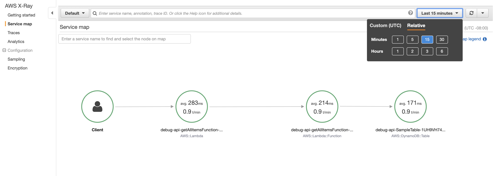


### 2. Breaking our code

Let's try to break our code and see how this reflects in the X-Ray Service Map.

1. First, let's disable the sample unit test that is enabled in the Lambda Application so that it doesn't interfere with what we will be doing. Open up `buildspec.yml` located in the root directory.

2. Comment out the line `- npm run test`. It should look like this:
  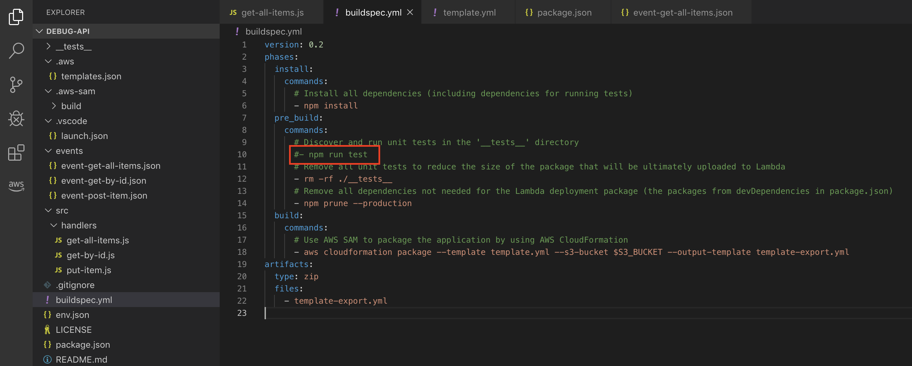

3. Open up `get-all-items.js` and change line 27 to the following:

  ```js
  const params = { TableName: Math.random() >= 0.5 ? "redacted" : tableName };
  ```

  You should have the following code snippet:
  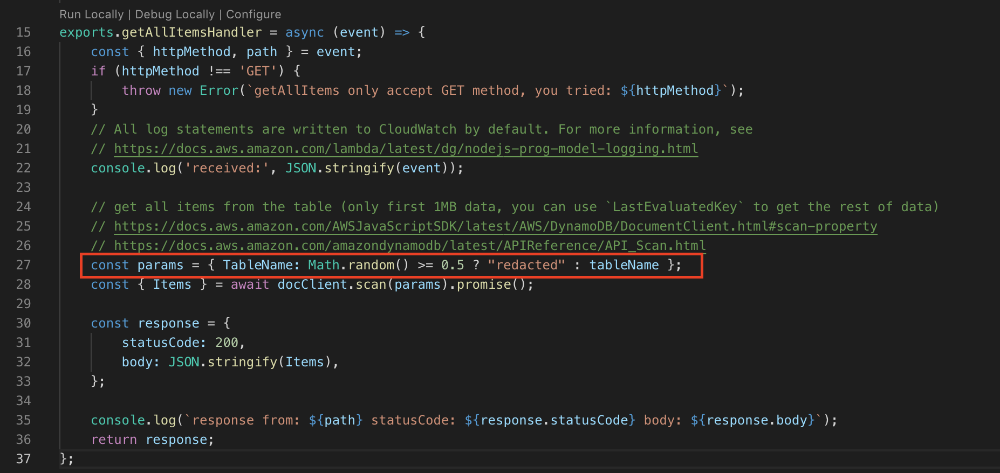

  What we have done here is to create a ~50% chance that the request will reach an invalid DynamoDB table and result in an error.

4. Stage the change on the file `get-all-items.js`, commit and push the change to the CodeCommit respository.

5. Give it a few minutes for [CodePipeline](https://us-west-1.console.aws.amazon.com/codesuite/codepipeline/pipelines/) to pull the code, build and deploy it to our API Gateway endpoint.

6. Find the API Gateway endpoint from [Lambda Application](https://us-west-1.console.aws.amazon.com/lambda/home?region=us-west-1#/applications) console and open it up in your browser.

7. Hit refresh a couple of times (> 20 times!).

8. Head over to [X-Ray](https://us-west-1.console.aws.amazon.com/xray/home) console and view the Service Map. You should see something like this:

    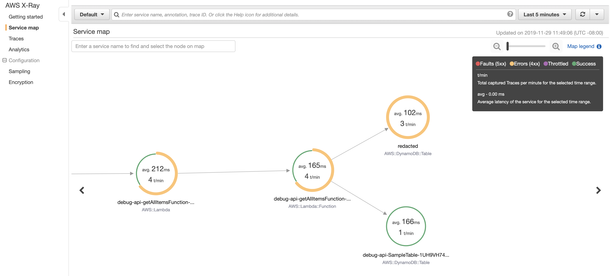

  Note that almost half of the requests (depending on your sample size) are yellow, due to error 400 (authentication error) from DynamoDB for accessing a (non-existent) DynamoDB table. The green traces are those requests that reached a valid DynamoDB table.

  In typical microservices architecture, it is likely that your application connects to one or more data sources to perform queries or writing (e.g. RDS, DynamoDB, Elasticache etc.). The service map helps you to visualise which resource is giving you problems and this can be traced all the way back to the root causes. Imagine scaling to hundreds of microservices and how useful this could be.

### Viewing Traces and Trace Maps

You can further use **Traces** to zoom in on specific errors and view more detailed information. Use filters to classify trace data to narrow down your search for the fault.

1. In the X-Ray console, open **[Traces](https://us-west-1.console.aws.amazon.com/xray/home?region=us-west-1#/traces/)** tab on the left.

2. Change the **Group by** dropdown to **Error root causes**. You will see that the traces will be classified into 2 main group - one with error and one without. Notice that the group with error shows you the path the trace has taken across the services.

3. Click on `debug-api-getAllItemsFunction-Q23ex(...)`.

4. At the bottom, you can see all the trace data collected and open them up for further analysis. Click on any one of them.

5. You should see the following:
  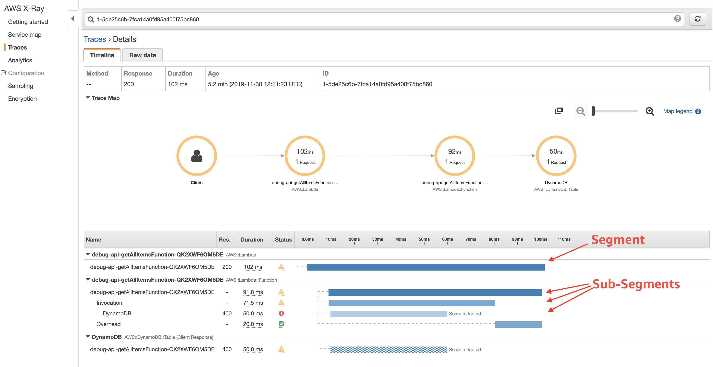

  The timeline view shows a hierarchy of segments and subsegments. The first entry in the list is the segment, which represents all data recorded by the service for a single request.

  Below the segment are subsegments. This example shows subsegments recorded by instrumented Amazon DynamoDB clients, and a custom subsegment.

6. Click on the **DynamoDB Subsegment** to view more details.

7. Click on the **Exceptions** tab. You should be able to see the authorization error message.
  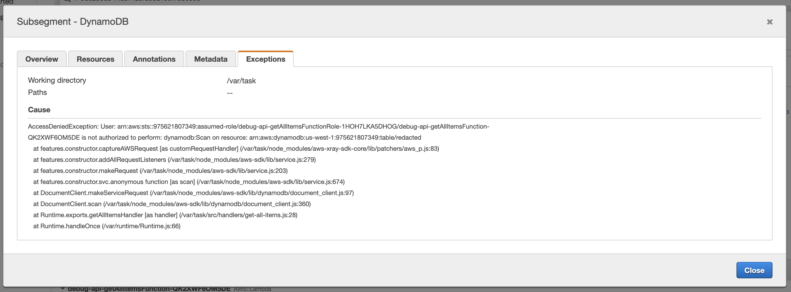

### 3. Slowing our code

One of the many use cases of X-Ray is to also identify application performance issues. By looking in AWS X-Ray traces, we can view the duration of trace segments and subsegments. Let's try to slow down some parts of our function to see how it looks like in X-Ray. Also, we will wrap this additional code as an X-Ray sub-segment.

1. Undo the breaking change that we have done in the previous steps. Replace the `tableName` back to where it was:
  ```javascript
  const params = { TableName: tableName };
  ```

2. Add the following code after the DynamoDB scan command.
  ```javascript
  await AWSXRay.captureAsyncFunc('Processing a delay', async (subsegment) => {
          await new Promise(resolve => setTimeout(resolve, 5000));
          if (subsegment){
              subsegment.close();
          }
      });
  ```

  You should end up with something like this:
  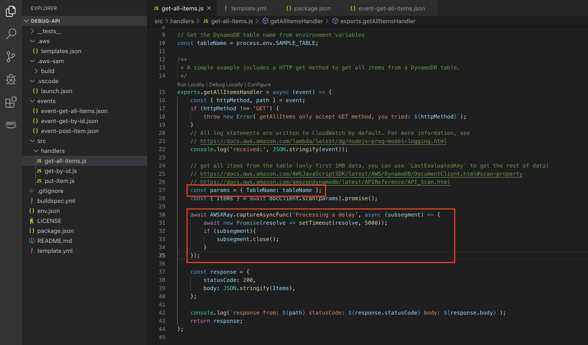

  What we have added here are two things:
  - Add a delay of 5 secs after the DynamoDB scan call.
  - Use X-Ray `captureAsyncFunc` function to wrap the code to add subsegments to the xray trace.

3.That's it! Stage the change on the file `get-all-items.js`, commit and push the change to the CodeCommit respository.

4. Give it a few minutes for [CodePipeline](https://us-west-1.console.aws.amazon.com/codesuite/codepipeline/pipelines/) to pull the code, build and deploy it to our API Gateway endpoint.

5. Find the API Gateway endpoint from [Lambda Application](https://us-west-1.console.aws.amazon.com/lambda/home?region=us-west-1#/applications) console and open it up in your browser.

6. Hit refresh a couple of times.

7. Head over to the [X-Ray](https://us-west-1.console.aws.amazon.com/xray/home) console and view Traces for this. You should see something like this:

  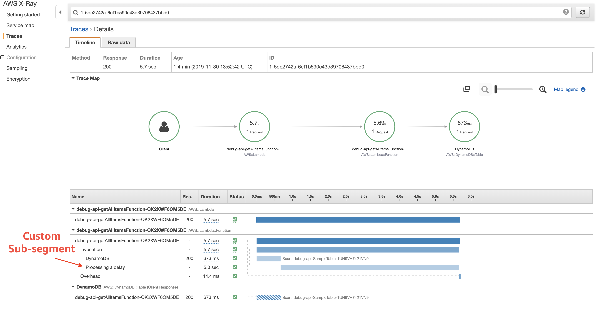

Notice the huge 5 seconds latency resulted in both the lambda container and function calls while DynamoDB remains at low latency. Looking at Trace details also reveal the large latency from the custom sub-segment we have created.

Subsegments extend a trace's segment with details about work done in order to serve a request. Each time you make a call with an instrumented client, the X-Ray SDK records the information generated in a subsegment. You can create additional subsegments to group other subsegments, to measure the performance of a section of code, or to record annotations and metadata.

### 4. :zap:\*New\* - CloudWatch ServiceLens

[CloudWatch ServiceLens](https://aws.amazon.com/about-aws/whats-new/2019/11/announcing-amazon-cloudwatch-servicelens/) enhances the observability of your services and applications by enabling you to integrate traces, metrics, logs, and alarms into one place.

ServiceLens integrates CloudWatch with AWS X-Ray to provide an end-to-end view of your application to help you more efficiently pinpoint performance bottlenecks and identify impacted users.

Think of this as an X-Ray Service Map - *on steroids*.

1. Open up the [CloudWatch](https://us-west-1.console.aws.amazon.com/cloudwatch/home?region=us-west-1) console.

2. Find [ServiceLens](https://us-west-1.console.aws.amazon.com/cloudwatch/home?region=us-west-1#servicelens:map) on the left panel. Click on **Service Map**.

3. You will see a similar ServiceLens Service Map, but with an enhanced UI with more details plugged in from CloudWatch + X-Ray.

  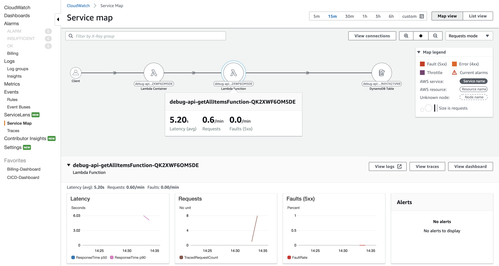

4. Try changing **Requests Mode** to **Latency Mode** to see how the node sizes change.

5. Try out [ServiceLens Traces](https://us-west-1.console.aws.amazon.com/cloudwatch/home?region=us-west-1#servicelens:traces) as well and experiment with the filters to get more insights of the application.

## Completion

You have successfully integrated AWS X-Ray and demonstrated how it can be used to identify errors, latencies, and create your own subsegments.

Next, let's challenge yourself to a debugging experience with what you have learnt so far. Proceed to [3. Debugging Challenge](../3_DebuggingChallenge) to begin.
