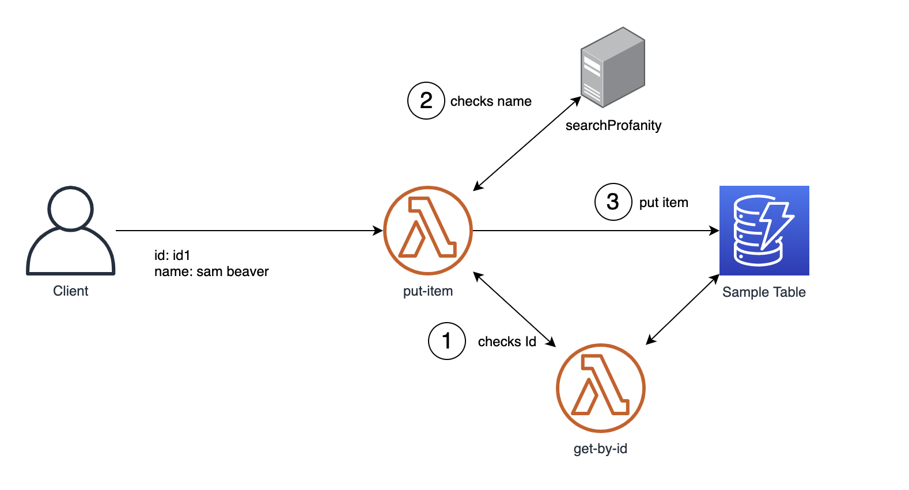
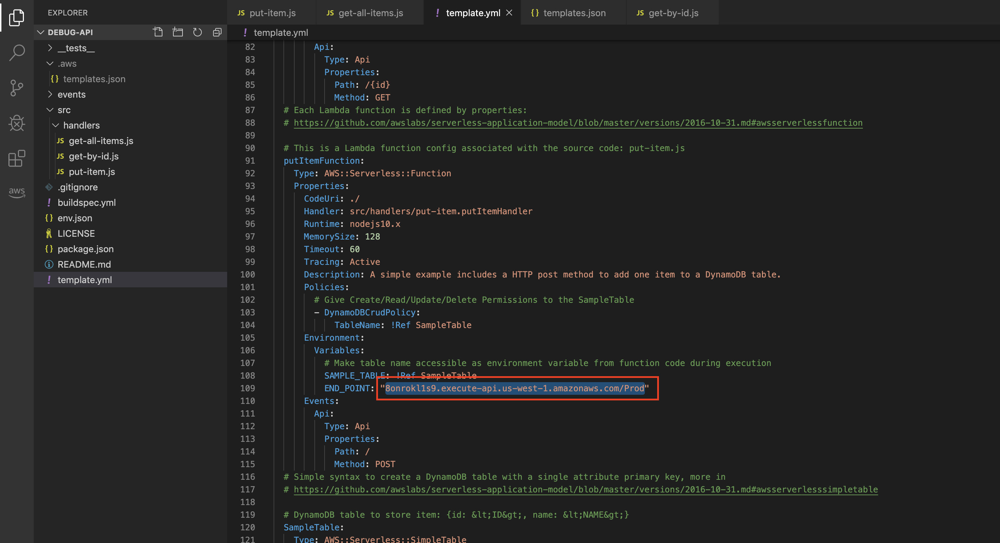

# Module 3: Debugging Challenge [Bonus]

### Introduction
In this module, we will try out a mini debugging exercise.

We will be adding some additional checks in `put-item.js` when inserting items into the DynamoDB Table.

This is what's going to happens when you try to insert an item (id, name) into the DynamoDB table:

1. Checks if the inserted `id` is already existing in the DynamoDB Table.
  - If yes, throws an error
  - If no, continue

  This is achieved by calling our own API `get-by-id` to check if the item already exists.

2. Checks if the inserted `name` contains profanity via an external function that takes in the name value and return if it contains profanity or not.
  - If yes, returns 1, and the `put-item` function throws an error.
  - If no, continues.

3. Item is inserted into DynamoDB successfully.



### Setting up
We will make the following changes to 2 files below:

1. Open up `put-item.js` and replace the contents with the following code:
  https://ym-reinvent.s3-us-west-1.amazonaws.com/put-item.js

2. In `template.yml`, make changes to `putItemFunction` resource to include an additional **Environment variable** `END_POINT: "<API Gateway Endpoint>"`. The value should be your API Gateway endpoint that you have copied earlier. You should end up with something like this:

  

### Running the code
You can test the code from a terminal using the following:
```bash
ENDPOINT=<paste-your-endpoint-here>
```

```bash
$ curl -d '{"id":"id1", "name":"My first item"}' -H "Content-Type: application/json" -X POST $ENDPOINT
```

### Sample Runs

For example, assuming the following items are existing in the DynamoDB Table:
- [{"id":"**id1**","name":"**john doe**"},{"id":"**id2**","name":"**peanut apple**"},{"id":"**id3**","name":"**summer wind**"}]

Sample calls:
```bash
$ curl -d '{"id":"id1", "name":"My first item"}' -H "Content-Type: application/json" -X POST $ENDPOINT
{"message": "Internal server error"}
```
> The above should fail because the id already exists.

```bash
$ curl -d '{"id":"id100", "name":"butt smack"}' -H "Content-Type: application/json" -X POST $ENDPOINT
{"message": "Internal server error"}
```
> The above should fail because it contains profanity

### Notes
- Your changes should only be limited to the `put-item.js` file.
- Use `Debug Locally` with breakpoints to help troubleshoot the issue.
- Use X-Ray custom sub-segments to help you.

### Completion
You have successfully integrated AWS X-Ray and demonstrated how SAM and the AWS Toolkit can be useful to identify errors, latencies, and aid in resolution. Next, use the [Cleanup Guide](../9_CleanUp) to cleanup the resources that you've created.
