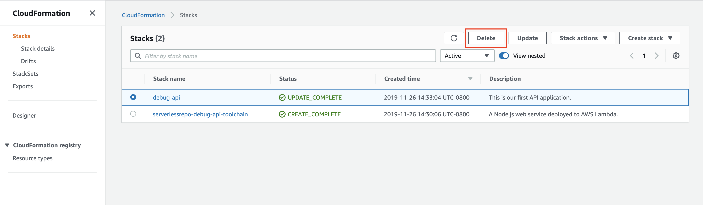
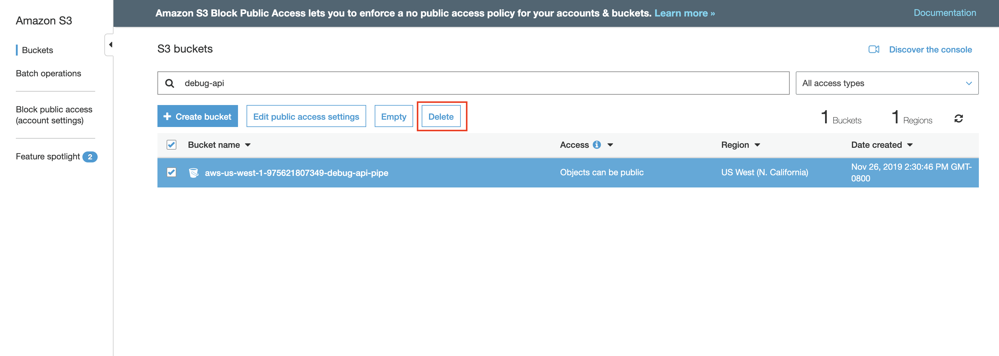
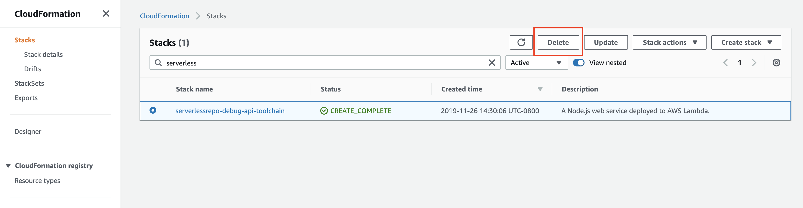

# Workshop Cleanup

This page provides instructions for cleaning up the resources created during the preceding modules.

## Resource Cleanup Instructions

Please follow the instructions in order to remove the resources used in the workshop from your account.

### 1. Delete Lambda Application Stack

1. In the AWS Management Console choose **Services** then select **CloudFormation**.

2. Select `debug-api`.

3. Click on **Delete** to remove the application stack.
  

### 2. Delete Project's S3 Bucket

1. In the AWS Management Console, click **Services** then select **S3** under Storage.

2. Type `debug-api` in the Filter checkbox.

3. Click the bucket icon next to the S3 bucket that matches the format: `{AWS::Region}-{AWS::AccountId}-debug-api-pipe`.

  

4. Click the **Delete Bucket** button at the top of the Bucket list.

5. Type the name of the bucket to confirm the deletion and click **Confirm**.

### 3. Delete Lambda Application Toolchain

1. In the AWS Management Console choose **Services** then select **CloudFormation**.

2. Select `serverlessrepo-debug-api-toolchain`.

3. Click on **Delete** to remove the toolchain stack.
  
