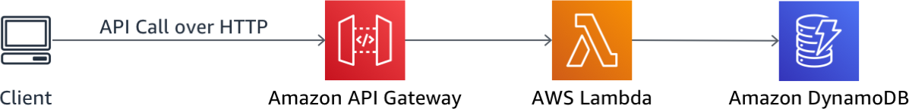
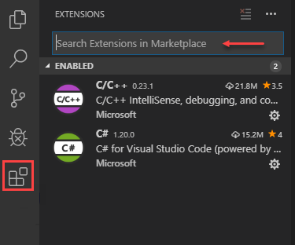

# Debugging serverless applications

*Note: The following workshop series is customized for AWS re:Invent 2019 Builders Session on **"DOP340: Debugging serverless applications"** and may contain content that is based on having resources provided during the workshop.*

In this workshop, you'll learn how to better manage Lambda Applications, use [Serverless Application Model (SAM)](https://github.com/awslabs/serverless-application-model) to debug locally and try out X-Ray to trace code errors & performance issues.

You will use SAM to deploy API interfaces, business logic, and database into your AWS account. The RESTful API will allow a user to add items into a DynamoDB table and view list of items added.

The application architecture uses [AWS Lambda](https://aws.amazon.com/lambda/), [Amazon API Gateway](https://aws.amazon.com/api-gateway/), and [Amazon DynamoDB](https://aws.amazon.com/dynamodb/).  The API is built using Lambda and API Gateway, using DynamoDB as a persistent data store for data.

See the diagram below for a depiction of the API architecture.



The serverless application that you will deploy runs on a DevOps Continuous Delivery Pipeline which uses [AWS CodePipeline](https://aws.amazon.com/codepipeline/), [AWS CodeBuild](https://aws.amazon.com/codebuild/), and [Amazon S3](https://aws.amazon.com/s3/).  CodePipeline orchestrates the steps to build, test, and deploy your code changes.  CodeBuild compiles source code, runs tests, and produces software packages that are ready to deploy to environments.

## Prerequisites

### 1. AWS Account
In order to complete this workshop you'll need an AWS Account with access to create AWS IAM, S3, DynamoDB, Lambda, API Gateway, CodePipeline, and CodeBuild resources. The code and instructions in this workshop assume only one student is using a given AWS account at a time. If you try sharing an account with another student, you'll run into naming conflicts for certain resources. You can work around these by appending a unique suffix to the resources that fail to create due to conflicts, but the instructions do not provide details on the changes required to make this work.

All of the resources you will launch as part of this workshop are eligible for the AWS free tier if your account is less than 12 months old. See the AWS Free Tier page for more details.

### 2.IAM Users

We will be assuming that you are running any command lines with an **Administrator** role for this workshop.

#### To create an IAM user:
1. Sign in to the AWS Management Console and open the IAM console at [https://console.aws.amazon.com/iam/](https://console.aws.amazon.com/iam/).

2. In the navigation pane, choose **Users** and then choose **Add user**.

3. Type the user name for the new user. This is the sign-in name for AWS.

4. Select the type of access this set of users will have. Select both **Programmatic Access** and **AWS Management Console**
   + **Programmatic access** are for users that require access to the API, AWS CLI, or Tools for Windows PowerShell. This creates an access key for each new user. Download the key pair by clicking on **Download .csv file**. Store the keys in a secure location.
   + **AWS Management Console access** are for users that require access to the AWS Management Console. Users use a username and password to access the console. We will use this access to view and verify resources created.

5. Choose **Next: Permissions**.

6. On the **Set permissions** page, specify how you want to assign permissions to this set of new users. Choose **Attach existing policies to user directly**.

7. In the search box, type in **Administrator**. Select the Administrator policy to attach to the user.

</p></details>
<p>

### 3. AWS Toolkit for Visual Studio Code

Throughout this workshop, we will be assuming that you are using [Visual Studio Code](https://code.visualstudio.com/) with AWS Toolkit installed. You may use other IDEs of your choice but the screens and steps would differ.

<details>
<summary><strong>HOW TO install AWS Toolkit for VS Code (expand for details)</strong></summary><p>

Before you can install the Toolkit for VS Code, you must have the following:
- VS Code version 1.31.1 or later [VS Code download](https://code.visualstudio.com/) page.
- Node.js SDK: https://nodejs.org/en/download

#### Installing AWS Toolkit for VS Code:
1. Start the VS Code editor.

2. In the Activity Bar on the side of the VS Code editor, choose the **Extensions** icon. This opens the Extensions view, which allows you to access the **VS Code Marketplace**.

  

3. In the search box for **Extensions**, search for AWS Toolkit for Visual Studio Code. Choose the entry to see its details in the right pane.

4. In the right pane, choose **Install**.

5. Once installed, if you're prompted to restart the editor, choose **Reload Required** to finish installation.

6. Open the **Command Palette**, on the menu bar, choose **View**, **Command Palette**. Or use the following shortcut keys:
  - Windows and Linux – Press Ctrl+Shift+P.
  - macOS – Press Shift+Command+P.

7. Search for AWS and choose **AWS: Create Credentials Profile**.

8. Enter a name for the initial profile.

9. Enter the **Access key ID** from the credential file (.csv) you have downloaded earlier.

10. Enter the **Secret access key** from the credential file (.csv) you have downloaded earlier.

</details>

### 4. AWS Command Line Interface

Follow the [AWS CLI Getting Started](https://docs.aws.amazon.com/cli/latest/userguide/install-cliv1.html) guide to install and configure the CLI on your machine. Use CLI version 1 for this workshop.

To configure the AWS CLI with a user you have created from step 2 earlier, follow the [Configuring the AWS CLI](https://docs.aws.amazon.com/cli/latest/userguide/cli-chap-configure.html) guide.

### 5. AWS SAM CLI
[AWS SAM CLI](https://docs.aws.amazon.com/lambda/latest/dg/test-sam-cli.html) is the AWS CLI tool for managing Serverless applications written with [Serverless Application Model (SAM)](https://github.com/awslabs/serverless-application-model).  SAM CLI can be used to test functions locally, start a local API Gateway from a SAM template, validate a SAM template, and generate sample payloads for various event sources. We will try using the SAM CLI to test functions and host our local API Gateway in this session.


#### Windows, Linux, macOS with pip [Recommended]
The easiest way to install **`sam`** is to use [pip](https://pypi.org/project/pip/). You must have [Python](https://www.python.org/) installed and added to your system's Environment path.

```bash
pip install aws-sam-cli
```

Verify the installation worked:

```bash
sam --version
```

#### Binary release

We also release the CLI as binaries that you can download and instantly use. You can find them under [Releases](https://github.com/awslabs/aws-sam-cli/releases) in the SAM CLI repo.


### 6. Docker
Running Serverless projects and functions locally with SAM CLI requires Docker to be installed and running. SAM CLI will use the `DOCKER_HOST` environment variable to contact the docker daemon.

* macOS: [Docker for Mac](https://store.docker.com/editions/community/docker-ce-desktop-mac)
* Windows: [Docker Toolbox](https://download.docker.com/win/stable/DockerToolbox.exe)
* Linux: Check your distro's package manager (e.g. yum install docker)

For macOS and Windows users: SAM CLI requires that the project directory (or any parent directory) is listed in Docker file sharing options.

Verify that docker is working, and that you can run docker commands from the CLI (e.g. `docker ps`). You do not need to install/fetch/pull any containers - SAM CLI will do it automatically as required.


## Modules

This workshop is broken up into multiple modules. You must complete each module before proceeding to the next.

0. [Lambda Applications](0_LambdaApp)
1. [Serverless Application Model (SAM)](1_ServerlessApplicationModel)
2. [AWS X-Ray Integration](2_XRay)
3. [Debugging Challenge](3_DebuggingChallenge)
